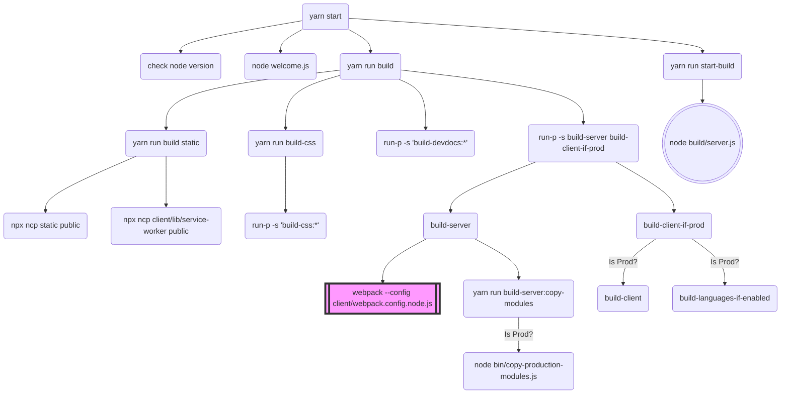

# Commands executed with yarn start

<!--

In order to update the diagram:

- Navigate to the below link `Link to the online version here`
- Edit the diagram in the `Code` tab
- At the bottom, expand the `Actions` section
- Click on `Copy Markdown`
- Paste the result below
- Update the `Link to the online version here` with the URL of the online diagram

- Alternatively, the diagram can be exported as a PNG file by clicking on `Download PNG` in the `Actions` section, use it as an image, and only update the `yarn-start.md` file
-->

This is a graphical representation of the commands being executed when you run `yarn start`:

## Diagram

[](https://mermaid.live/edit#pako:eNptVE1z0zAQ_Sse9VCHieP4o47jA0wLzNBCgRk4UfcgS3IsqkgaS25qOvnvrK2kJKHWxbP73u5b7a6eEVGUoQKtWqwb7-eVB18pje0F8zaaeDUXojirl_XU2FY9sOIsSZLdf7Dh1DZFqp9KOZxLv8et9IzFrZ0EwdsrnzSMPHgSUniPrDVcyYlLcAnu9_7o2DBB1JrNfpsDX99WLljbSa_quKBHTnPgHdMFhxgguxDmJMaAtZycwog5BQZgOkJ98sEXaC8w3rlDUPZIFTHFm_Mj4PU_oMMZ1kLp-7CCM2kDXge6VQdyDTBvfKmfPEn0TqWnu0qA2BfAZ9_bI1ycUPAqHOJzAr1Q7QPkOSRBEUD78p90sA-yS3kNbrikQ6F7K-Haf1VzKUcxMBt3dxtWaQwNDgKiZM1Xe107-8xZZ0Obob339ztuZYg-vXCXvSBK98Fa0U4wM6YiOgiujfcdUr8D6q2bmYrLcIQOkjpiYbD2rGGOgAj6j4hfj6p5DfFthxBYrjq8YmYomUlcCUbH-zRDf0GS7_slcjIGQuikQ94STSYTtwruoClas3aNOYUNey4ldBvZhq1ZiQr4pazGnbAlKuUWoJ2m2LKPlFvVoqLGwrApwp1VP3pJUGHbju1BHziGhV2_oITClAHpGdlej-vMjYWQrgGDvWsFmBtrtSnCcHDPVtw2XQVNWoeG0wa2qHlcZmEWZzmOE5YtEnyRJJRU0TKv4zSq6WIexRhtt1OksRyiPqEiXs7iOJpneZwv4GlIoinqUREtZvFyvkwv0jzP54tlnAPpj1IgOZrN02yeRuDJ0kWaAYGNNd-6l2h8kMYMv0b8WOL2L2LbjD4)

## Mermaid Diagram

[Link to the online version here](https://mermaid.live/edit#pako:eNptVE1z0zAQ_Sse9VCHieP4o47jA0wLzNBCgRk4UfcgS3IsqkgaS25qOvnvrK2kJKHWxbP73u5b7a6eEVGUoQKtWqwb7-eVB18pje0F8zaaeDUXojirl_XU2FY9sOIsSZLdf7Dh1DZFqp9KOZxLv8et9IzFrZ0EwdsrnzSMPHgSUniPrDVcyYlLcAnu9_7o2DBB1JrNfpsDX99WLljbSa_quKBHTnPgHdMFhxgguxDmJMaAtZycwog5BQZgOkJ98sEXaC8w3rlDUPZIFTHFm_Mj4PU_oMMZ1kLp-7CCM2kDXge6VQdyDTBvfKmfPEn0TqWnu0qA2BfAZ9_bI1ycUPAqHOJzAr1Q7QPkOSRBEUD78p90sA-yS3kNbrikQ6F7K-Haf1VzKUcxMBt3dxtWaQwNDgKiZM1Xe107-8xZZ0Obob339ztuZYg-vXCXvSBK98Fa0U4wM6YiOgiujfcdUr8D6q2bmYrLcIQOkjpiYbD2rGGOgAj6j4hfj6p5DfFthxBYrjq8YmYomUlcCUbH-zRDf0GS7_slcjIGQuikQ94STSYTtwruoClas3aNOYUNey4ldBvZhq1ZiQr4pazGnbAlKuUWoJ2m2LKPlFvVoqLGwrApwp1VP3pJUGHbju1BHziGhV2_oITClAHpGdlej-vMjYWQrgGDvWsFmBtrtSnCcHDPVtw2XQVNWoeG0wa2qHlcZmEWZzmOE5YtEnyRJJRU0TKv4zSq6WIexRhtt1OksRyiPqEiXs7iOJpneZwv4GlIoinqUREtZvFyvkwv0jzP54tlnAPpj1IgOZrN02yeRuDJ0kWaAYGNNd-6l2h8kMYMv0b8WOL2L2LbjD4)
