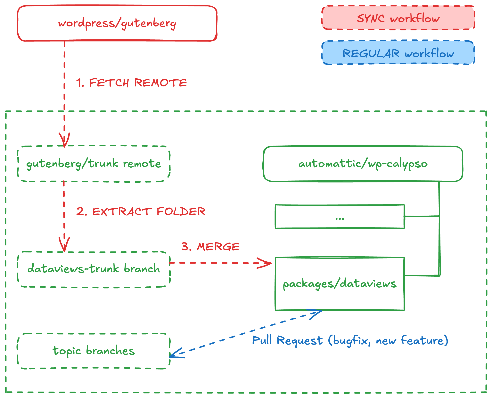

# Syncing from upstream

The `@automattic/dataviews` package extends the `@wordpress/dataviews` package (called upstream in this document). We regularly sync changes from the upstream repository into this one to keep it up-to-date. There are two workflows when working with this package: the regular day-to-day operations and the sync.

- **Regular workflow**: this is calypso as you know it. DataViews is a directory in the project, its syncing process remaining invisible, anyone who wants to land a bugfix or prepare a new feature will create a new Pull Request that can touch packages/dataviews along with other parts of Calypso.
- **Sync workflow**: this is a separate process that involves fetching changes from the upstream repository and merging them into the local repository. This document focuses on this workflow.



## Initial sync

This section documents how we did the [initial sync](https://github.com/Automattic/wp-calypso/pull/102276). We don't need to repeat this process, it's only here for full context.

1. Fetch Gutenberg (only the trunk branch).

```sh
git remote add -t trunk gutenberg git@github.com:WordPress/gutenberg.git
git fetch gutenberg --no-tags
```

2. Extract Gutenberg's packages/dataviews folder into a new branch. This branch, dataviews-trunk, will only have the contents of that folder.

```sh
git switch --detach gutenberg/trunk
git subtree split --prefix=packages/dataviews/ --branch=dataviews-trunk
```

3. Prepare a PR to merge dataviews-trunk into wp-calypso. For the initial setup, we need to connect the histories of gutenberg and wp-calypso repositories. See [git](https://www.kernel.org/pub/software/scm/git/docs/howto/using-merge-subtree.html) and [GitHub](https://docs.github.com/en/get-started/using-git/about-git-subtree-merges) docs.

  - `git merge ...` command: adds meta-information but doesn't bring any contents yet.
  - `git read-tree ...` command: stores the contents of the dataviews-trunk branch into packages/dataviews folder of wp-calypso.
  - `git commit ...` command: finalizes the merge process.

```sh
git checkout -b add/dataviews-package trunk
git merge -s ours --no-commit --allow-unrelated-histories dataviews-trunk
git read-tree --prefix=packages/dataviews/ -u dataviews-trunk
git commit -m "Merge dataviews into packages/dataviews/" --no-verify
```

4. Push branch to wp-calypso.

```sh
yarn
git commit -am "Add packages/dataviews"
git push -u origin add/dataviews-package
```

## Updates

This section documents how to perform subsequent syncs to the `packages/dataviews` folder in wp-calypso. Follow these steps to bring changes from upstream.

1. Fetch latest changes from upstream.

```sh
#    Only add the remowe if you don't have it already.
git remote add -t trunk gutenberg git@github.com:WordPress/gutenberg.git
git fetch gutenberg --no-tags
```

2. Create or update the dataviews-trunk branch. This extracts the contents of the packages/dataviews/ folder from upstream into a new branch, dataviews-trunk. It'll create the branch if it doesn't exist, or update it if it does.

```sh
git switch --detach gutenberg/trunk
git subtree split --prefix=packages/dataviews/ --branch=dataviews-trunk
```

3. Prepare a PR to update wp-calypso. This is a regular git merge. It's merging the dataviews-trunk branch into the packages/dataviews folder in this repository.

```sh
git checkout -b update/dataviews-package trunk
git merge -Xsubtree=packages/dataviews/ dataviews-trunk
```

4. Push to wp-calypso.

```sh
yarn
git push -u origin update/dataviews-package
```

In the 3rd step, the merge may stop if git was unable to resolve conflicts automatically. If that's the case, resolve them manually and continue the merge process (`git merge --continue`). This is expected, and it’s [how the git merge algorithm works](https://oandre.gal/git-merge/). This happens when both Calypso’s DataViews and Gutenberg’s DataViews changed the same part of a file.

Typical conflicts you may encounter when syncing from upstream:

- The `package.json` version. `@wordpress/dataviews` and `@automattic/dataviews` have each their own version sequence. When pulling changes from upstream, resolve this conflict by using the version number we maintain in this repository to release `@automattic/dataviews`.

## Merge into wp-calypso

Once the initial sync or the update is complete (there's a new Pull Request available in wp-calypso), it's time to merge the upstream changes into wp-calypso. **We need to merge the changes via a merge commit** for the histories to remain connected and subsequent updates work properly. This is how we do it:

- Create a Pull Request in wp-calypso, like you'd normally do (see "Update" section before). Let's say the PR is `update/dataviews-package`.
- Now, go to the console, merge the PR into `trunk` and push.

```sh
git switch trunk
git merge update/dataviews-package
git push
```

This will create a merge commit in `trunk` and push it to the remote repository. GitHub will auto-close the existing Pull Request.

Alternatively, we could have done the following: enable merging in GitHub UI, then merge the PR into `trunk` via the merge button, then disable merging again. However, the [merge button in GitHub UI](https://docs.github.com/en/repositories/configuring-branches-and-merges-in-your-repository/configuring-pull-request-merges/about-merge-methods-on-github) disables fast-forwards (it's the equivalent of doing `git merge --no-ff`), creating an extra unnecessary merge commit that makes history more difficult to follow.
