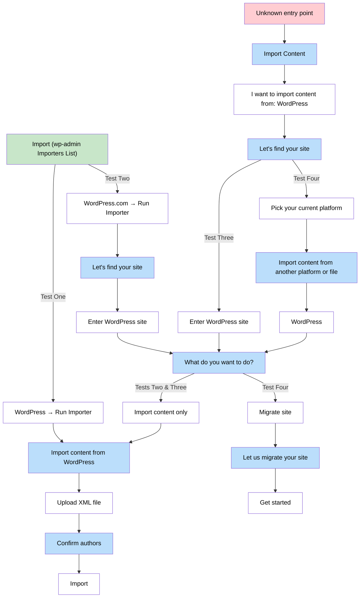
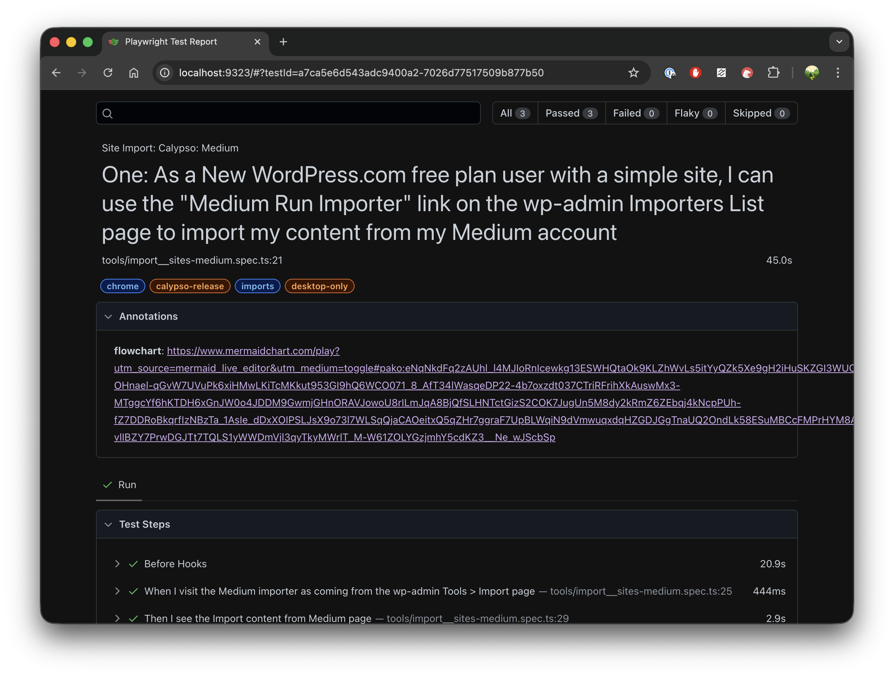

# Flowcharts

## Table of contents

- [Overview](#overview)
- [Example](#example)

## Overview

Flowcharts are a good way of representing what an e2e test covers in the system.

MermaidJS is a good resource for generating flowcharts using plain text source formatting, which is viewable on GitHub and in VSCode using an extension.

## Example

An example is:



You can easily annotate a Playwright Test test with a link to the MermaidJS flow chart URL like:

```typescript
annotation: {
			type: 'flowchart',
			description:
				'https://www.mermaidchart.com/play?utm_source=mermaid_live_editor&utm_medium=toggle#pako:eNqNkdFq2zAUhl_l4MJIoRnIcewkg13ESWHQtaOk9KLZhWvLs5itYyQZk5Xe9gH2iHuSKZGI3WUOcm6C_Z3_19H34qWYUW_h5SW2aZEIBZvlloN-OHnael-qGvW7UVuPk6xiHMwLKiTcMKkut953GI9hQ6WCO071_8_AfT34lWasqeDP22-4b7oxzdt037CTriRFrihXkAuswMx3-MTggcYf6hKTDH6xGnJW0o4JDDM9GwmjGHnORAVJowoU8rILmJqA8BjQfSLHNTctGizS2COK7JugUn5M8dy2kRmZ6ZEbqj4kNcpPUh-fZ7DDRoBkqrfIzNBzTa_1AsIe_dDxXOIPSLJsX9o73l7WLSqQjaCAOeitxQ5qZHr7ggraF7UpBLWqiN9dVmwuqxdqHZGDJGgTnaUQ2OndLk58ESuMBCcFMPrHYM8AsQ7J9JxoYkWR8D_hw3pJaMei94LNZ6l2Jd2L1l3l4iKercN4fpViiWLxXCbpz3eYb7C20OIGoYnNWi5X6-vlIBZY7PrwDGJTt7TQLS1yWWDmVjl3qyTkyMWrlT_M-W61ZOLYGzjmhY5cdKZ3__Ne_wJScbSp',
		},
```

which means when it runs the HTML report shows a link to the flowchart:


