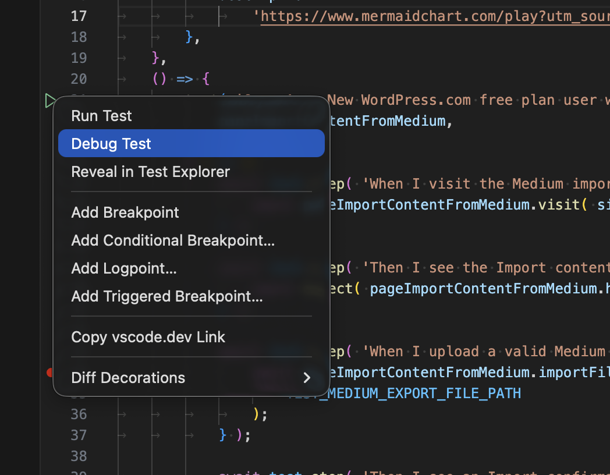
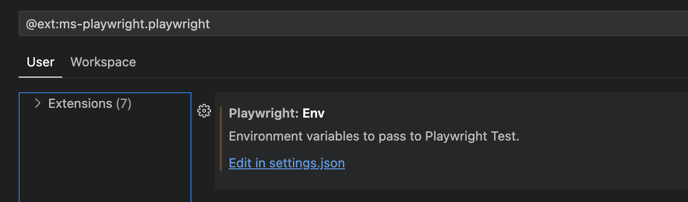

# Running & Debugging Tests

## Table of Contents

- [Running via Playwright VSCode Extension](#running-via-playwright-vscode-extension)
  - [Setting custom environment variables for the Playwright VSCode Extension](#setting-custom-environment-variables-for-the-playwright-vscode-extension)
- [Running via Terminal](#running-via-terminal)
  - [Running different types of tests via the Terminal](#running-different-types-of-tests-via-the-terminal)

## Running via Playwright VSCode Extension

Once you have installed the [Playwright VSCode Extension](./setup.md) it is easy to run and debug tests via the extension pane, or directly from the test specifications themselves.



### Setting custom environment variables for the Playwright VSCode Extension

You can easily set custom environment variables for the Playwright VSCode Extension. For example, the `CALYPSO_BASE_URL` variable controls the base URL of the Calypso application that your tests will target:

1. "View -> Extensions"
2. Locate Playwright and click "Settings"
3. Locate `Playwright: Env` and "Edit in settings.json"
4. Add or update any environment variables under `playwright.env`:

```
"playwright.env": {
  "CALYPSO_BASE_URL": "http://calypso.localhost:3000"
},
```



## Running via the Terminal

Before running the following commands, open your terminal and navigate to the `./test/e2e` directory from the project root:

```bash
cd ./test/e2e
```

Running the tests:

```bash
yarn test:pw -- <test_path>
```

where `<test_path>` is a directory of tests or a test file, e.g. `./specs/tools/import__sites-medium.spec.ts`.

> **Note:** The double underscore (`__`) in test file names (e.g., `import__sites-medium.spec.ts`) is used to separate the feature (`import`) from the scenario or specific case (`sites-medium`), improving organization and readability.

### Running different types of tests via the Terminal

- `yarn test:pw:desktop`  
  Runs tests targeting desktop browsers to verify desktop-specific user experiences and functionality.

- `yarn test:pw:mobile`  
  Executes tests in mobile browser environments to ensure mobile responsiveness and features work as expected.

- `yarn test:pw:calypso-pr`  
  Runs only the tests relevant for Calypso pull requests, helping validate changes before merging.

- `yarn test:pw:calypso-release`  
  Executes tests required for Calypso release validation, ensuring stability and correctness before deployment.

- `yarn test:pw:authentication`  
  Runs authentication-related specs to verify login, logout, and user session flows, using different authentication providers.

- `yarn test:pw:a8c-for-agencies`  
  Targets tests specific to the Automattic for Agencies features and scenarios.

- `yarn test:pw:i18n`  
  Runs internationalization specs to check language support and locale-specific functionality.
