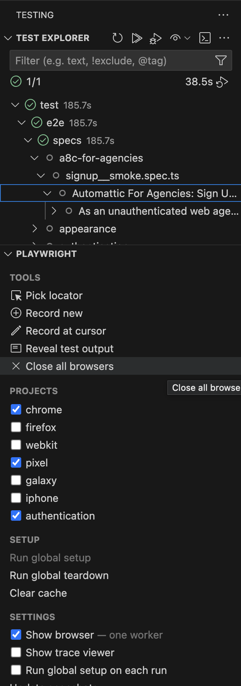

# Playwright Test Setup

## Table of contents

- [Quick start macOS](#quick-start-macos)
  - [Install Homebrew](#install-homebrew)
  - [Install nvm](#install-nvm)
  - [Install the required nodeJS version](#install-the-required-nodejs-version)
  - [Use the installed nodeJS version](#use-the-installed-nodejs-version)
  - [Enable yarn package manager](#enable-yarn-package-manager)
  - [Clone this repository](#clone-this-repository)
  - [Navigate to the cloned directory](#navigate-to-the-cloned-directory)
  - [Install project dependencies](#install-project-dependencies)
  - [Obtain the secrets decryption key](#obtain-the-secrets-decryption-key)
  - [Decrypt the secrets file](#decrypt-the-secrets-file)
  - [Transpile the packages](#transpile-the-packages)
  - [Run tests](#run-tests)
  - [Playwright VSCode extension](#install-and-use-playwright-vscode-extension)
- Related
  - [Decrypt test environment](../docs/test_environment.md)

## Quick start macOS

1. Install [Homebrew](https://brew.sh/) if not already installed.

2. Install `nvm`.

```bash
brew install nvm
```

3. Install the required nodeJS version.

```bash
nvm install <node_version>
```

4. Use the installed nodeJS version.

```bash
nvm use <node_version>
```

5. Enable `yarn` package manager.

```bash
corepack enable
```

6. Clone this repository

```bash
git clone https://github.com/Automattic/wp-calypso.git
```

7. Navigate to the cloned directory.

```bash
cd wp-calypso
```

_From this point on, all commands are executed within the `wp-calypso` root directory._

8. Install project dependencies.

```bash
yarn install
```

9. Obtain the secrets decryption key.

```bash
export E2E_SECRETS_KEY='your-calypso-e2e-config-decode-key-here'
# Replace the above value with the actual key from the Automattic secret store
```

10. Decrypt the secrets file to access sensitive configuration required for running tests.  
    See [Decrypt](../docs/test_environment.md) for more details.

```bash
yarn workspace wp-e2e-tests decrypt-secrets
```

11. Transpile the packages.

```bash
yarn workspace wp-e2e-tests build --watch
```

12. Run tests

```bash
yarn workspace wp-e2e-tests test:pw -- <test_path>
```

By default, tests should run on <http://calypso.localhost:3000>. If you wish to run them on another environment, such as <https://wpcalypso.wordpress.com>, you can set an environment variable:

```bash
CALYPSO_BASE_URL=https://wpcalypso.wordpress.com yarn workspace wp-e2e-tests test:pw -- <test_path>
```

13. Install and use Playwright VSCode extension

Install the [Playwright VSCode Extension](https://marketplace.visualstudio.com/items?itemName=ms-playwright.playwright).

When opening the `wp-calypso` directory the extension should automatically detect the Playwright Test projects:


